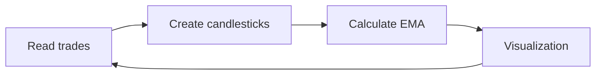

# Cryptocurrency Trading Bot

## Technical specification

[Link to Technical specification](https://docs.google.com/forms/d/e/1FAIpQLSclBNFgcGeG36NmLK2FGPOcyhKBDpRyFGWtsR5K-IE31NyMnw/viewform)

### *Interview Task:*
Create a Candlestick Chart and Calculate the Exponential Moving Average (EMA)

### *Objective*
Your task is to create a public project on GitHub or GitLab and write a program to perform the following operations:

· **Retrieve Trades:** Read the trades from the provided CSV file. https://perp-analysis.s3.amazonaws.com/interview/prices.csv.zip

· **Form Candlesticks:** Based on the given time period, aggregate the trades into candlesticks (OHLC format).

· **Calculate EMA:** Implement a function to calculate the Exponential Moving Average (EMA) for the given length.*

### *Requirements*

· **Language:** Python.

· **Repository:** Create a public repository on GitHub or GitLab and upload all the necessary files.

· **Read Trades:** Your program must be able to read trades from a provided CSV file. The file will contain the following columns: Timestamp, Price.

· **Candlestick Formation:** Aggregate trades into candlesticks based on the provided time interval (e.g., 5 minutes, 1 hour). The candlesticks should include Open, High, Low, Close values.

· **EMA Calculation:** Implement a function to calculate the Exponential Moving Average (EMA) with a given length (e.g., 14 periods). Your function should be well-documented and tested.

### *Submission*

· Include a README file that explains how to run your code and any dependencies.

· Provide a link to the public repository containing the code.

· Include sample outputs or visualizations if possible.

### *Evaluation*

Your submission will be evaluated based on the following criteria:

· **Code Quality:** Clear, concise, and well-organized code.

· **Functionality:** The code performs the specified tasks correctly.

· **Documentation:** Proper comments and documentation for understanding the code.

· **Testing:** Include unit tests to ensure the correctness of the code.

### *Deadline*

· Please submit your completed project within one three days from receiving this task.

## Schedule
- At the request of the business

## Code Requirements
· **Python Version:** Python 3.9.12

· **Python Requirements:** requirements.txt

· **Launch:** cryptocurrency_trading_bot/main.py

## Launch Instructions

1. Create a venv: **python -m venv /path/to/new/virtual/environment**
2. Install necessary requirements: **pip install -r requirements**
3. Check the path to the **prices.csv** file
4. Run the file **cryptocurrency_trading_bot/main.py**
5. Get the result from output

## Result

## Code Description
1. Gets data from a CSV file **[trades.read()]** using _pandas.read_csv_ method.
2. Create candlesticks **[candlesticks.create()]** using _pandas.DataFrame.resample_ method.
3. Calculate EMA **[ema.calculate()]** using _pandas.DataFrame.ewm_ method.
4. Visualization result **[visualization.show()]** by graphic using _mplfinance_

## Literatures
1. **pandas:** https://pypi.org/project/pandas/
2. **pandas.read_csv:** https://pandas.pydata.org/docs/reference/api/pandas.read_csv.html
3. **pandas.DataFrame.resample:** https://pandas.pydata.org/docs/reference/api/pandas.DataFrame.resample.html
4. **pandas.DataFrame.ewm:** https://pandas.pydata.org/docs/reference/api/pandas.DataFrame.ewm.html
5. **mplfinance:** https://pypi.org/project/mplfinance/

## Architecture

## Authors

| Role           | Name           | email                                                       | Phone |
|----------------|----------------|-------------------------------------------------------------|-------|
| Business Owner | AmaCryTeam     |                                                             |       |
| Developer      | Shatekov Sabyr | [shatekov.sabyr@gmail.com](mailto:shatekov.sabyr@gmail.com) |       |
